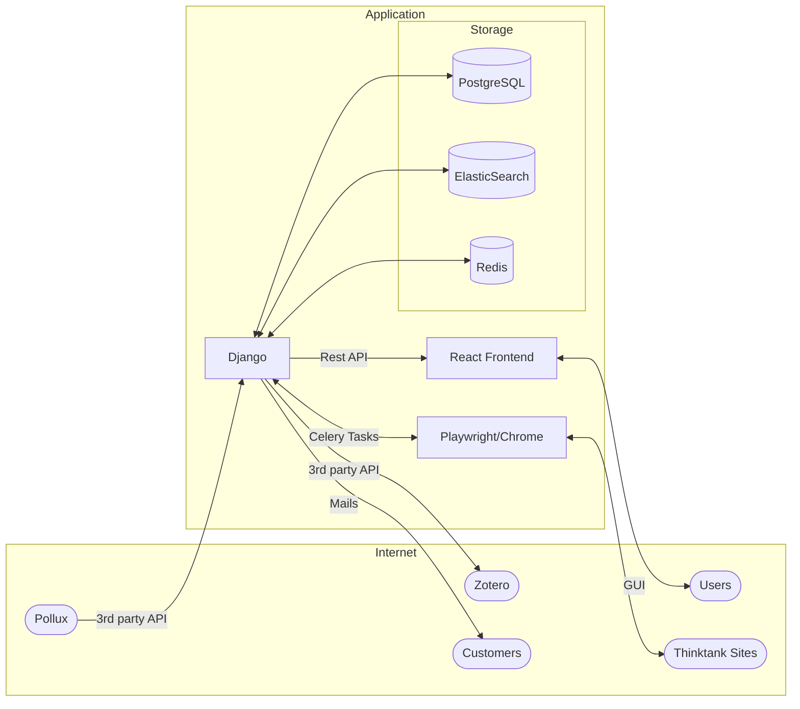
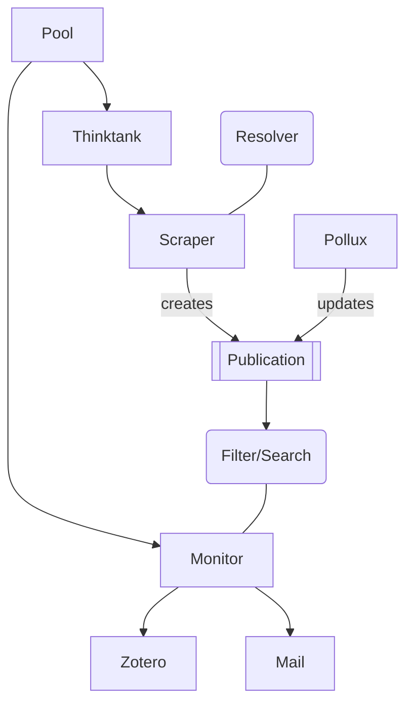

# Architecture Overview

The diagram below shows the main components of the SWP application and how they interact with each other. Core system is
a Python Django application that manages all data. Main storage component is a PostgreSQL relational database. Data is
additionally indexed in an ElasticSearch instance. Redis is used for task scheduling via Celery.

Thinktank Sites are scraped using the Playwright library, which controls a headless Chrome browser.

The React [frontend](frontend.md) provides a user interface for authenticated users to interact with the system. The
frontend communicates with the Django backend via REST [API](api.md).

The system delivers results to customers via mail and direct Zotero export.

Data is enriched by polling updates from Pollux.

## Data Architecture

The Django application manages various entities via Models. The main entities include Thinktanks, Scrapers, Monitors,
Publications, and Pools.

## Glossary

* Pool: a collection of Thinktanks, used to restrict the search scope and manage editing permissions
* Thinktank: a publisher of publications, e.g. a university or research institute
* Scraper: the configuration to exract data from a specific website, part of a thinktank
* Resolver: a configurable method to extract a single data point from a website, used by scrapers
* Publication: a single article or publication found on a thinktank's website, may contain the URL to a PDF file
* Monitor: manages a list of customers or Zotero instances that receive updates on new publications
* Filter/Search: a filter or search for publications, used by monitors to select the publications to send
* Zotero: an open source reference management software, see [zotero.org](https://www.zotero.org/). Monitors can send
  data to a Zotero instance.
* Citavi: a reference management software, see [citavi.com](https://www.citavi.com/). Monitors can send Citavi .ris
  files to customers by email.

